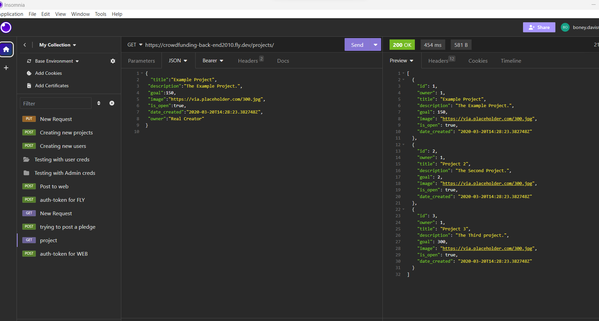
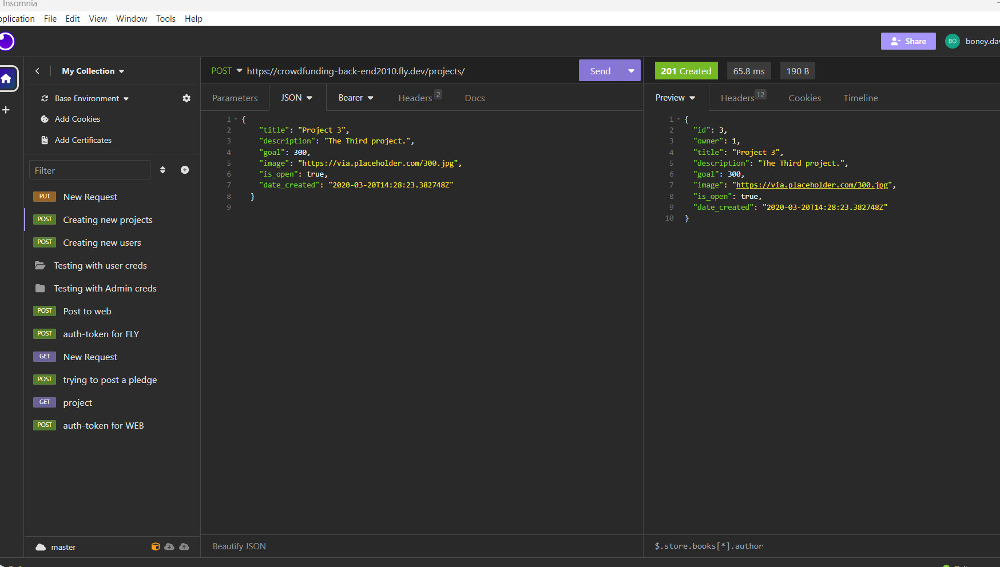
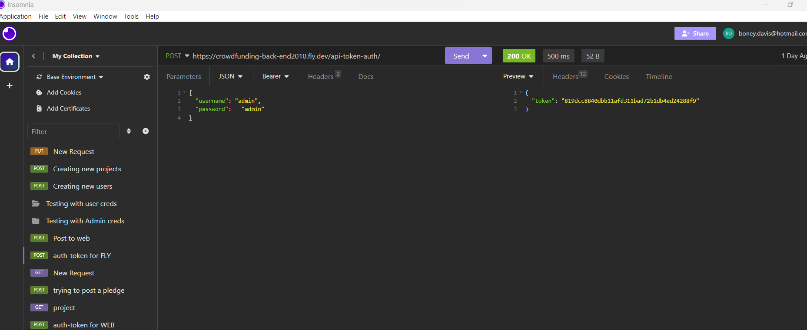
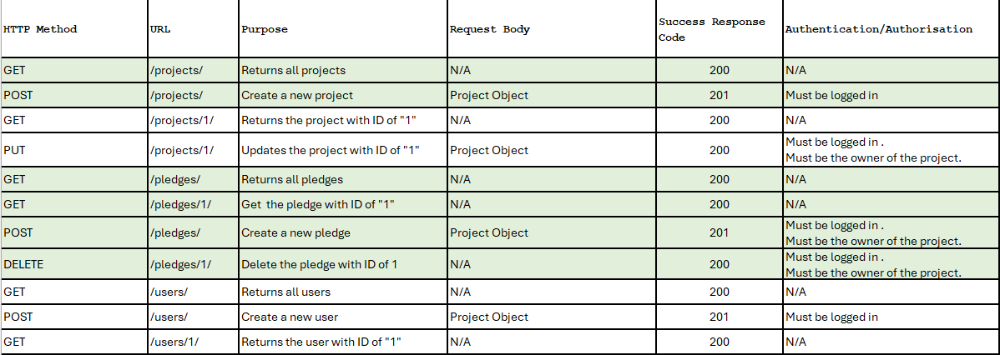
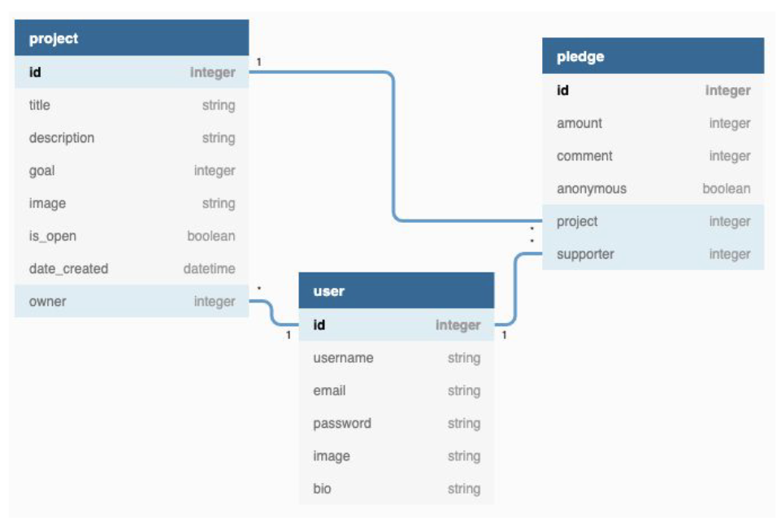

# crowdfunding_back_end
# Crowdfunding Back End Boney Davis

## Planning:
### Concept/Name
CrowdFunding Web App that allow user to Create or Delete funding projects. 

### Intended Audience/User Stories
 Provide a platform for people to fund projects that raises funds for education.

 [X] A link to the deployed project.
 https://github.com/boneycd/crowdfunding_back_end

 https://crowdfunding-back-end2010.fly.dev/projects/

 [x] A screenshot of Insomnia, demonstrating a successful GET method for anyendpoint.
 

 [x] A screenshot of Insomnia, demonstrating a successful POST method for anyendpoint.
 

 [x] A screenshot of Insomnia, demonstrating a token being returned.
 

 [x] Step by step instructions for how to register a new user and create a newproject (i.e. endpoints and body data).

 Using Insomnia:

Insomnia operates on a system of "Organizations", "Projects", and "Collections"
Organisations are at the top level of the Insomnia's structure. You can select them in the leftmost vertical ribbon in the Insomnia interface: It’s possible that if this is your first-time installing insomnia, you will need to create an organisation to work in. (This depends on your installation.) Calling your org "personal projects" or something similar is fine.

Projects are the next level down in Insomnia's structure. Each project corresponds to a single app or website you are creating. You can create and select projects in the left-hand pane of the Insomnia interface:

A collection is a set of HTTP requests that you are working on to test some aspect of your project. You can define multiple requests in a collection and issue them repeatedly to test your back end.

Since this is a new project, you can create a new collection by clicking the button in the center of the main pane in the Insomnia interface:

Create a collection now. You can call it "Demo" as well. This will transport you to the collection view:
For now, click the small (+) button at the top of the leftmost pane to create a new request:
Below are the steps to create token, create users and projects

Create Token:

We need to sort the authentication part first, In order to get the authentication to keys to set up. Make sure your local server is running, and then fire Insomnia up

We need to send a POST request to this endpoint to generate our token: http://localhost:8000/api-token-auth/

The JSON to include is just your username and password, like so:
{
"username":"<your_username_here>",
"password":"<your_password_here>"
}

The API will respond with a string of symbols - that's your token.

To include this token, we need to add it to the "Auth" tab of any future requests that require authentication. Specifically, we need to click the dropdown in the Auth tab, and select Bearer Then we need to paste our token into the TOKEN field. In the PREFIX field, we put the string Token

Now we can put our JSON in the body tab, and send our request:
If we fail to include the token, we get a 401 Unauthorised error!

Creating USERS:

We want to create an HTTP Request, click the GET dropdown and select POST instead:

Paste the link http://localhost:8000/users/ into the URL bar of your new request.

Now we need to supply some data. Click the Body dropdown and select JSON:

Now click in the middle/left pane and define some JSON data to send through with your POST request. We need a username, an email, and a password.

{
"username":"name",
"password":"putpassword",
"email":name@mail.com
}

Now  add the previously generated token to the "Auth" tab. Specifically, Click the dropdown in the Auth tab, and select Bearer Then we need to paste our token into the TOKEN field. In the PREFIX field, we put the string Token
Now press Send again! The API responds with the ID (primary key) of our new user account, plus confirmation of our username and email address.

Creating Project:

We want to create an HTTP Request, click the GET dropdown and select POST instead:

Paste the link http://localhost:8000/projects/ into the URL bar of your new request.

Now we need to supply some data. Click the Body dropdown and select JSON:

Now click in the middle/left pane and define some JSON data to send through with your POST request

{
    "title": "Project ",
    "description": "The Project ",
    "goal": 200,
    "image": "https://via.placeholder.com/300.jpg",
    "is_open": true,
    "date_created": "2020-03-20T14:28:23.382748Z"
}

Now  add the previously generated token to the "Auth" tab. Specifically, Click the dropdown in the Auth tab, and select Bearer Then we need to paste our token into the TOKEN field. In the PREFIX field, we put the string Token
Now press Send again! The API responds with the ID (primary key) of our new user account, plus confirmation of our username and email address.

 [x] Your refined API specification
 
 

 [x] Database Schema
 

